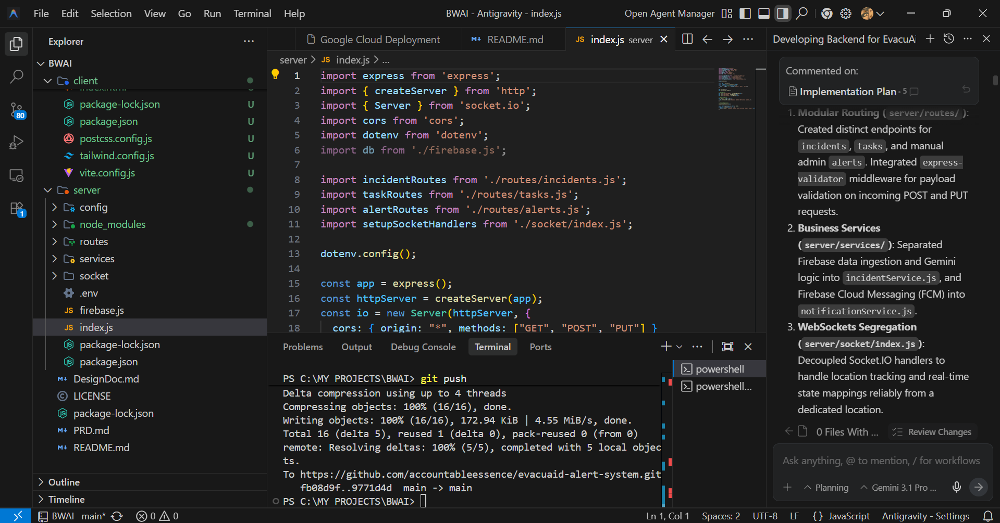
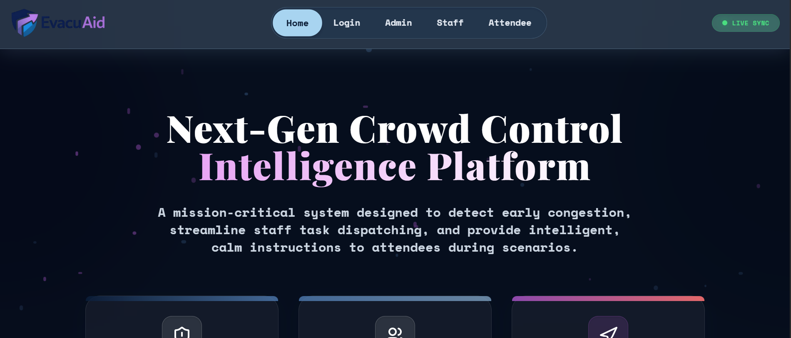
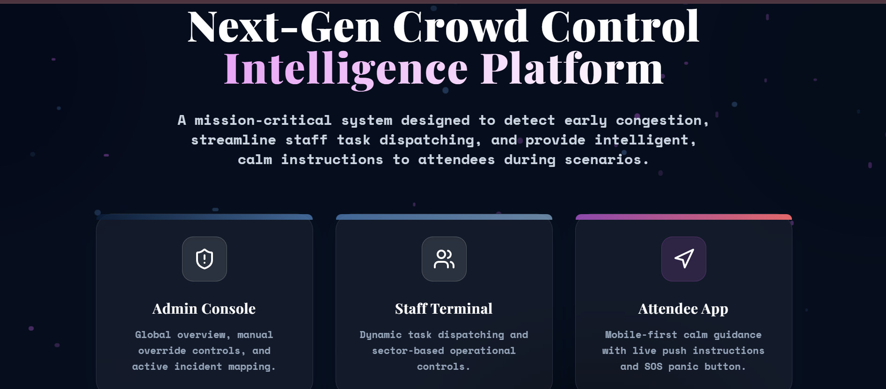
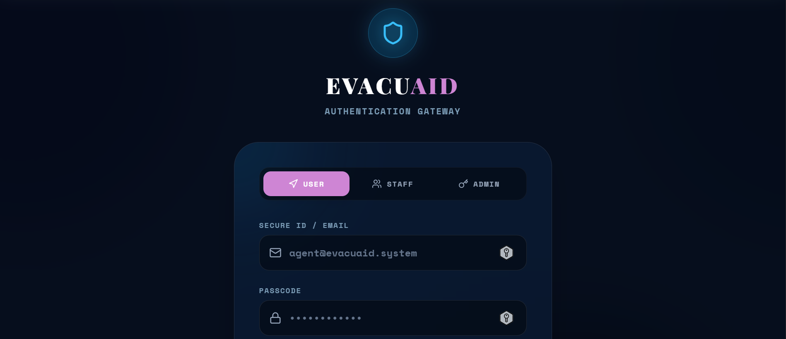
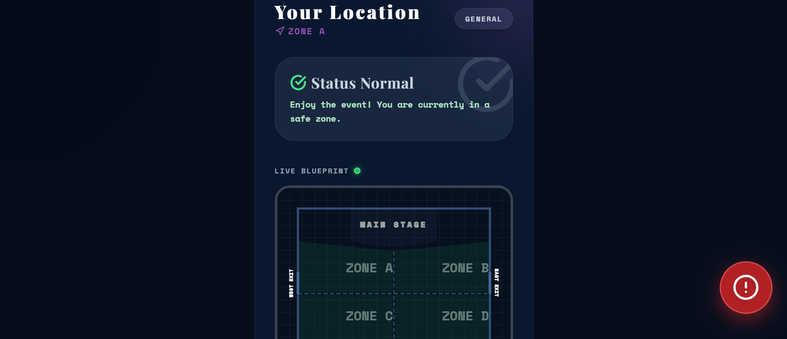
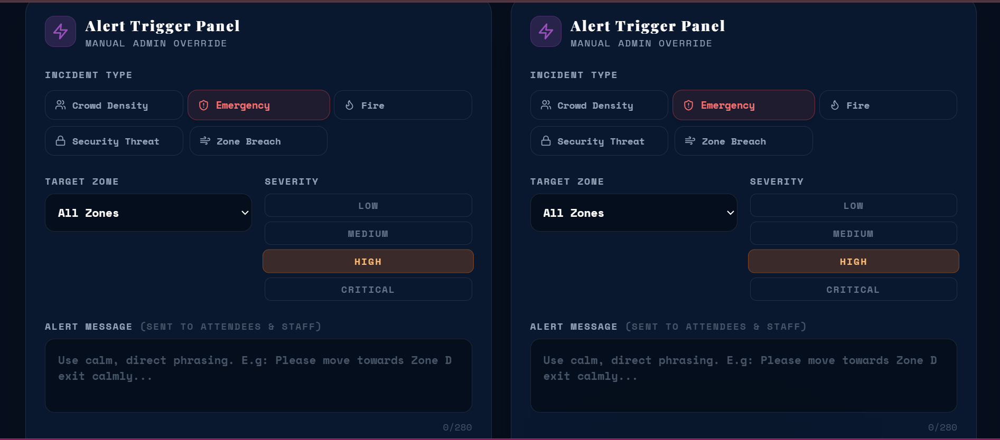

# EvacuAid

## Problem Statement
During large-scale events (concerts, festivals, conventions), sudden emergencies like medical incidents, fires, or crowd crushes can quickly escalate into mass panic. Security teams often struggle with delayed communication, and attendees frequently lack clear, immediate, and calming directions on how to safely navigate away from dynamic danger zones, leading to unsafe congestion.

## Project Description
EvacuAid is a full-stack, real-time emergency broadcast and crowd management platform designed to mitigate panic and efficiently coordinate safe evacuations. By utilizing a central React dashboard alongside a Node.js/Socket.IO backend, the system allows any user to instantly trigger an SOS. The core engine dynamically tracks danger zones on a live map across all devices instantly and generates automated, context-specific escape routes and security dispatch tasks. 

---

## Google AI Usage
### Tools / Models Used
- Google Gemini 2.5 Flash (`@google/genai` API)

### How Google AI Was Used
Google Gemini AI operates as the central intelligence hub for emergency response drafting. When an incident is logged into the Firestore database, the backend intercepts the raw SOS data (e.g., "FIRE down by the Main Stage") and feeds it into the Gemini model. Gemini processes the threat level and physical zone to instantly generate two crucial, automated payloads:
1. A very calm, 1-2 sentence exit guide immediately pushed to the phones of nearby attendees via Firebase Cloud Messaging so they know exactly where to walk.
2. A concise, actionable directive strictly assigned to the responding security task force. 

---

## Proof of Google AI Usage
Attach screenshots in a `/proof` folder:



---

## Screenshots 
Add project screenshots:

  





---

## Demo Video
Upload your demo video to Google Drive and paste the shareable link here(max 3 minutes).
[Watch Demo]
(https://drive.google.com/file/d/16I-bbFSPk1DsswKEG031cJ3ZTci46mv9/view?usp=drive_link)

---

## Installation Steps

```bash
# Clone the repository
git clone https://github.com/accountableessence/evacuaid-alert-system.git

# Go to project folder
cd evacuaid-alert-system

# Install backend dependencies & start server
cd server
npm install
npm run dev

# Open a new terminal alongside the server
# Install frontend dependencies & start React app
cd client
npm install
npm run dev
```